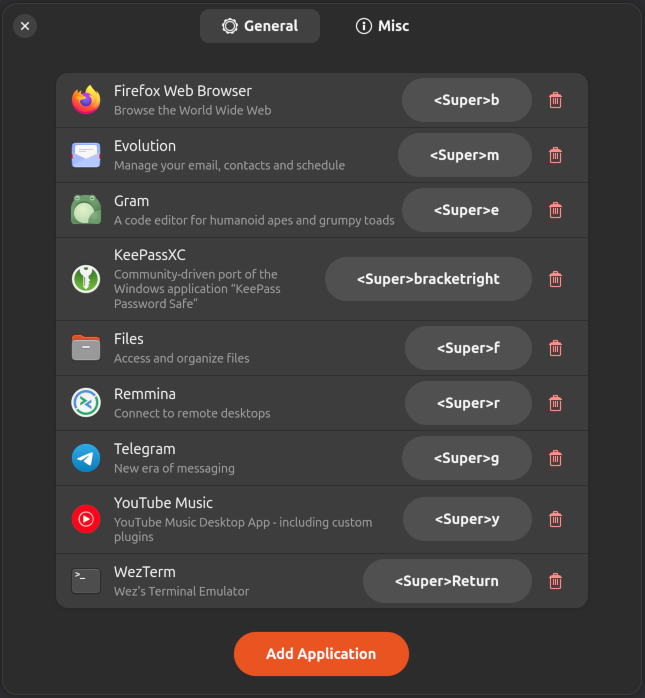

# Wunder App Hotkey — GNOME Shell Extension

A GNOME Shell extension that assigns hotkeys to apps to give them focus or launch them.



## Requirements

- GNOME Shell 49+

## Installation

### Manual Installation

1. **Download and install the extension files**

   ```sh
   git clone https://github.com/inbalboa/gnome-wunder-app-hotkey.git
   cd gnome-wunder-app-hotkey
   make build install
   ```
   Requires `git`, `make`, `jq`

2. **Restart GNOME Shell**

   Log out and log back in.

3. **Enable the extension**
   ```sh
   gnome-extensions enable wunder-app-hotkey@inbalboa.github.io
   ```

## Acknowledgments

This extension is a heavily rewritten fork of [Happy Appy Hotkey](https://github.com/jqno/gnome-happy-appy-hotkey)

## License

This project is licensed under the GPL-3.0-or-later License - see the [LICENSE](LICENSE) file for details.
